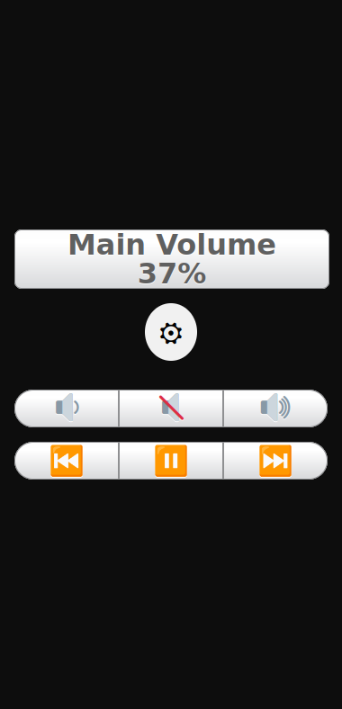
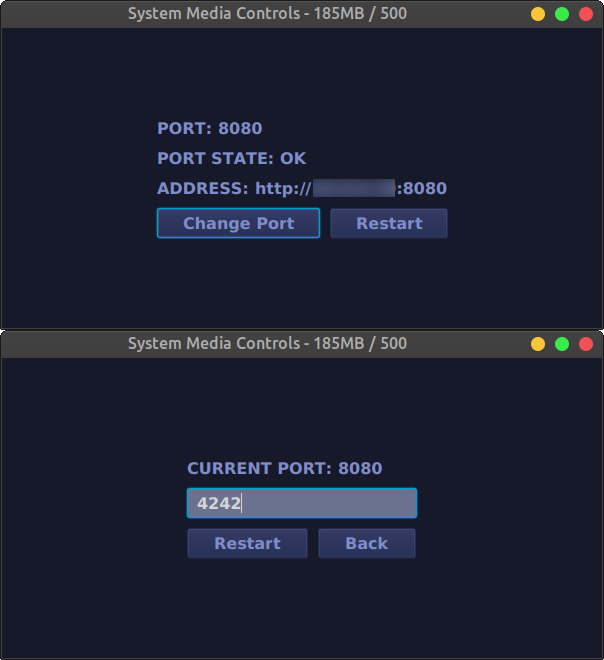
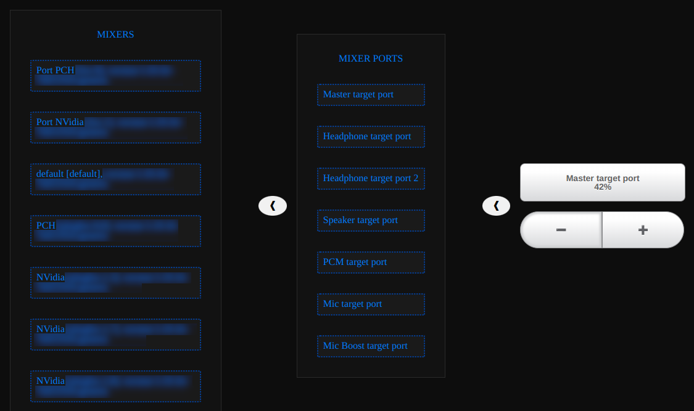

# System Audio Volume App
This app controls lets you control basic media functions from a browser.

In Advanced Settings
this app controls system audio volume, allowing you to increase
or decrease audio volume of a selected audio output line. 
## Tech Stack
 
- **Java**
- **Spring**
- **Spring Boot** 
- **Spring Web** 
- **Thymeleaf** 
- **HTML5**
- **CSS3**
- **Javascript**
- **JavaFX**
- **C/C++**  
### Screen Shots
- #### Browser view  
 
- #### Gui for changing Server port  
 
- #### Advanced menu 
  
### Notes
Only tested on Linux Mint 21 Vanessa  
**for c/c++ file to compile properly I needed to install these extra packages: libx11-dev,libxtst-dev and g++**
```
sudo apt install g++
sudo apt install libxtst-dev
sudo apt install libx11-dev
```


